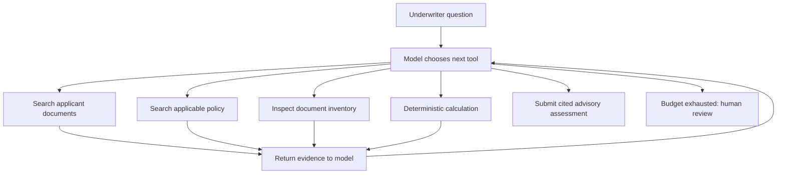

# Loan Underwriting Agentic RAG


## Start in 30 seconds

Python 3.9+; no runtime packages or API key required for the teaching replay:

```bash
python -m underwriting demo
python -m unittest discover -s tests -v
python -m underwriting baseline --question "What income and bonus does the applicant declare?"
```

Run commands from the repository root. The demo prints each tool call, evidence, and the final assessment. It follows a **scripted replay**, not an autonomous agent and not proof of model quality. The baseline retrieves applicant passages once; it is a retrieval-only comparator, not a full RAG answer benchmark.

## Real agent mode

```bash
export ANTHROPIC_API_KEY='your-key'
export ANTHROPIC_MODEL='your-tool-capable-model-id'
python -m underwriting live --application APP-001 --max-calls 10
```

Use a model available in your Anthropic account. `.env` files are not automatically loaded. Live mode sends questions and retrieved synthetic content to Anthropic and incurs API costs. It uses the Messages API with tool definitions and feeds tool results back into model context. The model chooses the queries and action order. Live provider behavior has not been validated with credentials in this project; offline tests validate the execution contract only.

## Why it is agentic

The original requirement was to answer a specific question from an applicant's documents. A single retrieval could support that task. The expanded requirement is to determine which evidence is still needed under applicable policy. Discovering a bonus can cause a policy search, and the policy can cause a search for historical statements.



The loop in `underwriting/core.py:run` is the agentic mechanism. It does not contain a bonus-specific branch. `models.py:Replay` deliberately does; it exists solely to teach and test the loop without an API key.

## Example investigation

1. Find declared income including a variable bonus.
2. Retrieve the fictional policy requiring two completed years of bonus history.
3. Search for historical statements.
4. Inspect the inventory: only 2025 is present.
5. Calculate an illustrative declared-income DTI from server-read fields.
6. Report missing 2024 history with citations for underwriter review.

A declared-income ratio is not verified qualifying income. The app never approves or denies a loan.

## What is implemented

- Two isolated synthetic applicant scopes and policy product/date filtering.
- Auditable tool arguments, results, and document/page references.
- Lexical term-overlap retrieval, with deterministic ranking; no embeddings or vector database yet.
- Decimal arithmetic reading authorized retrieved fixture values.
- Citation-ID provenance checking, unknown-tool/argument rejection, repeated-call detection, and an individual tool-call budget.
- Live Claude tool-use adapter, scripted offline replay, unit tests, GitHub Actions.

The CLI's application selection is a local demo scope, **not authentication**. A service deployment must derive allowed application IDs from authenticated permissions. Citation validation checks that a source was retrieved; it does not verify semantic entailment. Prompt instructions are not a complete prompt-injection defense.

## Layout

| File | Purpose |
|---|---|
| `underwriting/core.py` | Retrieval, tool definitions, validations, and agent loop |
| `underwriting/models.py` | Live provider and offline replay |
| `underwriting/__main__.py` | CLI |
| `data/corpus.json` | Synthetic extracted pages and fictional policy versions |
| `tests/test_core.py` | Execution and boundary tests |
| `docs/INTERVIEW.md` | Architecture explanation and evaluation plan |
| `docs/REFERENCES.md` | Inspiration and attribution |

## Scope and next steps

This is a small original MVP inspired by three architectures, not a merger or fork of their implementations. It consumes pre-extracted pages; PDF/OCR ingestion, layout-aware chunking, hybrid retrieval, full answer baseline, and model-quality evaluation remain extensions. No production lending accuracy or compliance claim is made.

See [interview notes](docs/INTERVIEW.md) and [references](docs/REFERENCES.md).
